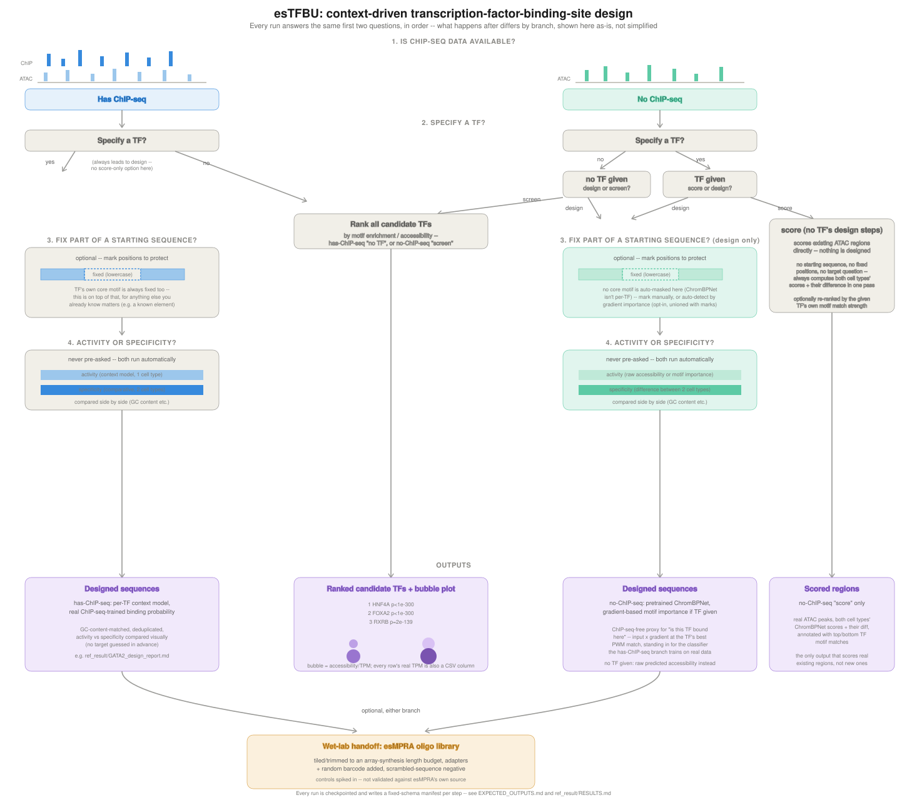
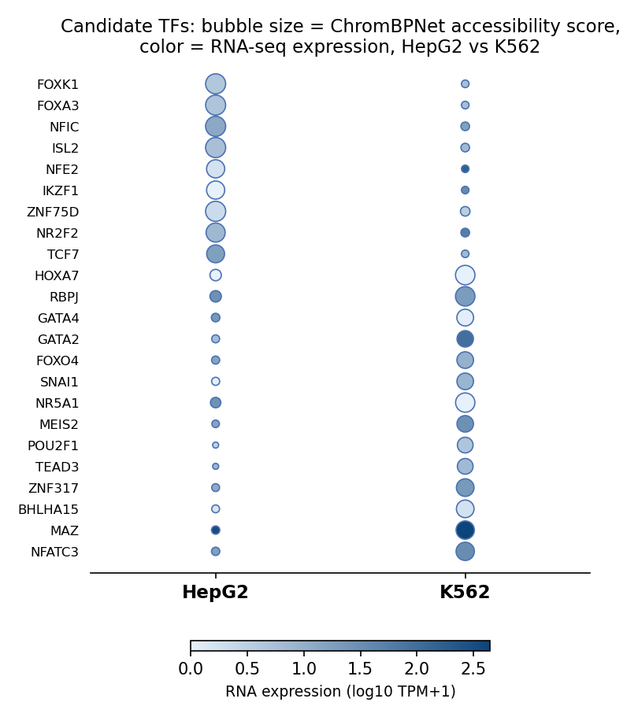
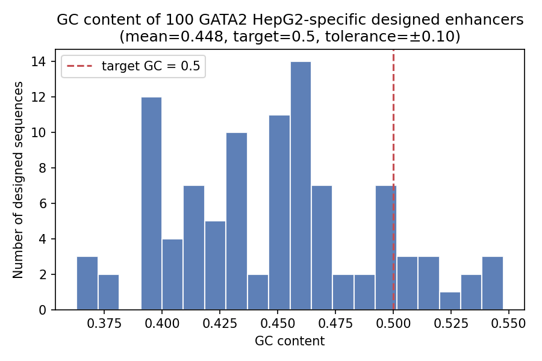

# esTFBU

A reusable, parameterized pipeline for enhancer modelling and design based
on transcription factor binding units (TFBU), reproducing and generalizing
the method from:

> Li, Zhang, Wang et al. "Modeling and designing enhancers by introducing
> and harnessing transcription factor binding units." *Nature
> Communications* (2025).
> [10.1038/s41467-025-56749-2](https://doi.org/10.1038/s41467-025-56749-2)

Two branches: **has-ChIP-seq** (train/reuse TFBS-context models, design
cell-type-specific enhancers via genetic algorithm) and **no-ChIP-seq**
(score, design, and genome-wide screen using only ATAC-seq + pretrained
ChromBPNet accessibility models). One config file, one CLI, no hardcoded
paths or TF names.

## How it works

Every run answers the same first two questions, in order -- what happens
after differs by branch, shown here as-is, not simplified:



## System requirements

CPU-only is fine for everything **except** training a from-scratch model
(has-ChIP-seq branch, any cell type without pretrained weights -- e.g.
K562's `specificity` scenario). That step's BiLSTM layers don't vectorize
on CPU the way convolutions do -- **measured ~70+ min per epoch** on
CPU alone. `train_context_model` automatically uses **MPS (Apple Silicon
GPU)** when available, measured **~11x faster** than CPU for this exact
architecture (0.2s/batch vs 2.2s/batch, direct benchmark) -- on an Apple
Silicon Mac this cuts a from-scratch train from hours to tens of minutes,
no configuration needed. On non-Mac CPU-only hardware (e.g. Linux without
CUDA), expect it to be slow -- the paper's own repo
([DeepTFBU](https://github.com/WangLabTHU/DeepTFBU)) says the same about
this exact architecture: "we strongly recommend running this program on a
computer with a GPU... otherwise it will take an extremely long time."
Everything else in this pipeline (inference against pretrained/frozen
models, motif scanning, GA design against an already-trained model) is
fast on CPU regardless. `run_pipeline.py` warns before starting a
from-scratch train so this isn't a surprise mid-run.

## Install

```bash
pip install -e .
```

or manually:

```bash
pip install torch numpy pandas pyyaml h5py numba pyfaidx python-Levenshtein \
            scikit-learn scipy bpnet-lite tangermeme requests
```

## Data setup (full-scale, beyond the bundled quickstart data)

Not included in this repo (~22GB total). Edit `config/default_config.yaml`
once these are in place:

1. **hg38 genome**: [UCSC](https://hgdownload.soe.ucsc.edu/goldenPath/hg38/bigZips/hg38.fa.gz) → `data/hg38/hg38.fa` (same file the Quickstart below already has you download)
2. **DeepTFBU repo** (paper's own code + bundled GATA2 ChIP-seq data):
   `git clone https://github.com/WangLabTHU/DeepTFBU data/DeepTFBU_repo`
3. **Pretrained HepG2 weights** (198 TFs): Zenodo [10.5281/zenodo.10931825](https://doi.org/10.5281/zenodo.10931825) → `data/model_weights/train_0/`
4. **Pretrained ChromBPNet models**: [Hugging Face / kundajelab](https://huggingface.co/kundajelab) (HepG2 `ENCSR042AWH`, K562 `ENCSR483RKN`) → `data/chrombpnet_models/{HepG2,K562}/`
5. **RNA-seq expression**: ENCODE HepG2 `ENCSR329MHM`, K562 `ENCSR000EYO` → `data/rna_seq/{HepG2,K562}/`
6. **JASPAR PFMs / TF-Ensembl mapping**: already included at `data/processed/` (small, ~100KB)

## Quickstart

```bash
git clone <this repo>
cd esTFBU
pip install -e .

# the one external download this repo can't bundle (~3GB, a generic public
# resource, same one command any genomics project would need):
mkdir -p data/hg38
curl -o data/hg38/hg38.fa.gz https://hgdownload.soe.ucsc.edu/goldenPath/hg38/bigZips/hg38.fa.gz
gunzip data/hg38/hg38.fa.gz

python3 run_pipeline.py   # answer 'y' at the first prompt to use sample_data/
```

That's every external dependency. `run_pipeline.py` walks you through
branch/TF/cell-type choices with prompts, runs each stage against the
real (if small) ChIP-seq/ATAC-seq/RNA-seq/pretrained-model data bundled in
`sample_data/`, and shows you the actual output at every step. See
**[EXPECTED_OUTPUTS.md](EXPECTED_OUTPUTS.md)** for what each of the 10
scenarios (every branch x action x TF-specified/not combination, plus the
blacklist gate) actually produces, including real measured run-to-run
variance where the output isn't bit-exact.

`sample_data/` covers 2 of the paper's 198 TFs (GATA2, HNF4A -- the only
two with a bundled ChIP-seq bed) and uses reduced GA-iteration/training-
epoch counts for speed; it's a faster demo, not a smaller one -- the
bundled ATAC/ChIP/histone bed files are the real, full-size ENCODE peak
sets (e.g. ~165k HepG2 / ~171k K562 ATAC peaks), not subsampled, so the
has-ChIP-seq branch's first step (a PPM scan over every ATAC peak) takes
as long as it would on the full-scale setup regardless of which config
you're using. It's not a replacement for the full-scale validated results
in `ref_result/RESULTS.md` either way. For the full 198-TF pipeline
against the complete original datasets, see **Data setup**
above and use `config/default_config.yaml` (answer 'n' at that same
prompt, or pass `--config config/default_config.yaml` to the CLI).

## Usage

**Interactive (recommended if you're new to this repo):**

```bash
python3 run_pipeline.py
```

A single script at the repo root that walks you through branch/TF/cell-type
choices with prompts, then runs the same underlying pipeline as the CLI
below. First prompt picks quickstart (`sample_data/`) or full-scale
(`config/default_config.yaml`) data. Good for a first run or a one-off;
for scripting/automation use the CLI directly.

**CLI (for scripting):**

```bash
# has-ChIP-seq branch: design cell-type-specific enhancers
python -m estfbu.cli --branch chipseq --tf GATA2 --cell-types HepG2,K562 \
  --target specificity --gc-target 0.4626

# no-ChIP-seq branch: score existing regions
python -m estfbu.cli --branch chrombpnet --cell-types HepG2,K562 \
  --target specificity --max-regions 5000 --annotate-top 10

# no-ChIP-seq branch: design new sequences
python -m estfbu.cli --branch chrombpnet --action design \
  --cell-types HepG2,K562 --target specificity

# no-ChIP-seq branch: genome-wide TF screening, no TF specified
python -m estfbu.cli --branch chrombpnet --action screen \
  --cell-types HepG2,K562 --target specificity

# has-ChIP-seq branch: rank every ChIP-seq-available TF instead of
# designing for one given TF ('screen' is the no-TF-specified path for
# this branch too -- no --tf needed)
python -m estfbu.cli --branch chipseq --action screen \
  --cell-types HepG2,K562 --target specificity

# any design run: also emit an esMPRA-shaped oligo library (adapters +
# barcode + scrambled controls) from the designed sequences -- see
# "Wet-lab handoff (esMPRA)" below
python -m estfbu.cli --branch chipseq --tf GATA2 --cell-types HepG2 \
  --target activity --emit-oligo-library --oligo-pre ACTGGCCGCTTCACTG \
  --oligo-after GGTACCTCTAGAGGATCCGG --barcode-pre CGTC --barcode-length 12
```

Full CLI reference (all flags, both branches) documented in each module's
docstring under `src/estfbu/`; `test_scripts/` has runnable
end-to-end examples of every mode above. Add `--config config/quickstart_config.yaml`
to any of the commands above to run against the bundled sample data instead
of the full-scale setup (defaults to `config/default_config.yaml`).

## Wet-lab handoff (esMPRA)

Either branch's design output (a FASTA of designed sequences) can be
turned into an esMPRA-shaped oligo library -- the terminal "wet experiment"
step of the original design brief, not an optional add-on: `--emit-oligo-library`
(CLI, all three of `--oligo-pre`/`--oligo-after`/`--barcode-pre` required)
or the equivalent interactive prompt after any design run trims/tiles each
designed sequence to fit an array-synthesis length budget, spikes in
scrambled-sequence negative controls (real inserts with bases shuffled --
same length/GC, no real regulatory content), and writes three files: the
bare inserts (`*_oligo_library_inserts.fasta`, matching esMPRA's
`--ref_fa`), the array-order oligos with adapters and a degenerate
`'N' * barcode_length` slot where the physical barcode goes
(`*_oligo_library.fasta`), and a JSON manifest
(`src/estfbu/oligo_library.py`).

**Verified against esMPRA's real source** (github.com/WangLabTHU/esMPRA,
`step1_oligo_barcode_map.py`), not just its documented interface: `--ref_fa`
genuinely wants bare inserts (its own `--help` says so verbatim), the
insert is extracted as everything between `oligo_pre` and the first
`oligo_after` match (so the barcode must sit outside that span, not
between the insert and `oligo_after`), and a design only counts as
"qualified" once `--min_barcode_per_oligo` (esMPRA's default: 3) distinct
barcodes are recovered from real sequencing reads -- which is why the
barcode here is a degenerate placeholder, not a value chosen in silico.
Not a guarantee of drop-in compatibility regardless -- if esMPRA's actual
behavior differs from what's described here, `oligo_library.py` is the
one file to fix.

## A deliberate deviation from the original design brief

The design brief's four questions include "high-activity or specificity?"
as something to ask up front. Both design paths (chipseq and chrombpnet)
don't ask this -- they run both objectives automatically and emit a GC-
content comparison plot, because the genetic algorithm needs exactly one
fitness objective per run, and running both beats guessing which one you
wanted before you've seen either. The ranking paths (chipseq/chrombpnet
`--action screen`) DO still ask/take `--target` explicitly, since ranking
existing candidates doesn't have the same one-objective-per-run
constraint. So: for ranking, yes, target is asked; for design, no, both
run and you get both outputs plus the comparison.

## Structure

```
run_pipeline.py       single-file interactive entry point (see Quickstart)
src/estfbu/            the package -- source of truth for the CLI/tests
config/                default_config.yaml (full-scale, external data),
                       quickstart_config.yaml (sample_data/, bundled), blacklist.txt
sample_data/           real (not synthetic) small ENCODE/JASPAR-derived data,
                       bundled directly in this repo -- every scenario in
                       EXPECTED_OUTPUTS.md runs immediately against it, no
                       downloads except the genome
test_scripts/          runnable examples + regression test suite
ref_result/            full-scale validated results (see EXPECTED_OUTPUTS.md
                       for the smaller/faster quickstart numbers instead)
```

(`archive/` -- preliminary reproduction work that led to this pipeline, not
part of the pipeline itself -- exists in local development history but is
gitignored, so it isn't in your clone; don't expect `archive/STATUS.md` to
be reachable.)

## Testing

```bash
python test_scripts/test_regression.py
```

The full regression suite (see `test_scripts/test_regression.py` for the
current list -- the count here has drifted out of date with the actual
file more than once, so it isn't restated) covers both branches
(including the has-ChIP-seq branch's CLI-exposed rank/screen path), the
blacklist gate, the motif-significance null model, expression validation,
the second-TF generalization check (HNF4A), TF-specific no-ChIP-seq
design, manual/auto-detected sequence-fixing, the configurable
`model.seq_len` knob (not just the paper's fixed 168bp), and the esMPRA
oligo-library self-consistency check. Uses `config/default_config.yaml` by
default (needs the full-scale external data set up per "Data setup"
above); set `ESTFBU_CONFIG=config/quickstart_config.yaml` to run against
the bundled `sample_data/` instead -- most tests still need real
genome/model files either way, this just picks which set.

## Highlight result

Genome-wide TF screening — **no TF specified in advance, no ChIP-seq data
used at all** — automatically ranked HNF4A, HNF4G, FOXA1/FOXA2/FOXA3,
HNF1A, RXRB, and TCF7L2 as the top HepG2-specific transcription factors:
the textbook hepatocyte master-regulator network, recovered purely from
ATAC-seq accessibility, a pretrained general accessibility model, and
JASPAR motifs. See `ref_result/RESULTS.md`.



GATA2 (highlighted case study throughout this repo) correctly shows up as
large and dark in the K562 column, not HepG2 -- consistent with the
cross-branch and RNA-seq validation in `ref_result/RESULTS.md` §4.

Designed sequences also land on target: the has-ChIP-seq branch's GATA2
HepG2-specific enhancer design (`ref_result/GATA2_design_report.md`)
enforces a GC-content target during postprocessing, and the real designed
output matches it:



## Results

See `ref_result/RESULTS.md` for the full validated-results summary:
model reproduction accuracy, cross-branch validation, second-TF
generalization, and the genome-wide screening result above.

## License

MIT (see `LICENSE`) for the code in this repo. Third-party data (ENCODE,
JASPAR, the paper's own DeepTFBU code and Zenodo/figshare deposits,
Kundaje lab's pretrained ChromBPNet models) carries its own terms.
